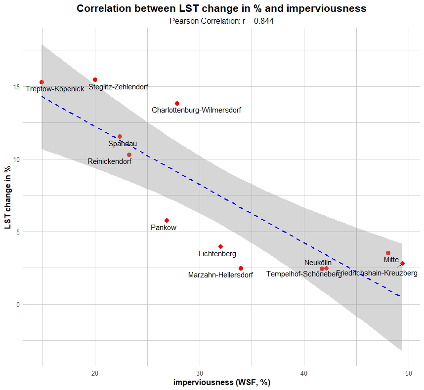

# WSFCoRRelatoR

This package provides functions to quickly calculate and display the correlation between the mean value of any given raster dataset with a single variable and the world settlement footprint.


## Conditions

For using this package in the best way, you need to have a raster (or multiple) with an existing coordinate reference system and a single value per pixel where the mean value can be extracted.

Furthermore the different areas to compare should be available in an vector format (polygon).

For the world settlement footprint you can download the matching tile on "https://download.geoservice.dlr.de/WSF2019/".


## Dependencies

The package uses the following packages:
- `terra`
- `sf`
- `dplyr`
- `ggplot2`
- `ggrepel`


## Installation

You can simply install the package via

```r
library(devtools)
install_github("D4t4mur/WSFCoRRelatoR")
library(WSFCoRRelatoR)
```


## Functions

The following functions are built in so far in this package:

| function              | explanation                                                                                                                                                     |
|-----------------------|-----------------------------------------------------------------------------------------------------------------------------------------------------------------|
| `load_example_data()` | loads examplary data, a summer-mean land surface temperature raster for Berlin, the wsf raster tile for Berlin and the twelve districts of Berlin as a shp-file |
| `rastmeancalc()`      | extracts all raster pixel values and calculates the mean                                                                                                        |
| `wsfcalc()`           | extracts all wsf raster pixel values and calculates the built-up area / imperviousness in %                                                                     |
| `builtuparea()`       | masks the examined polygon with the built-up area from the wsf raster                                                                                           |
| `combine_results()`   | combines the extracted values from data raster, wsf raster in a data frame                                                                                      |
| `visual_correlation()`| calculates the correlation and displays a plot showcasing the result                                                                                            |


## Example

To load the examplary data, execute

```r
example_data <- load_example_data()
berlin_districts <- example_data[[1]]
berlin_lst <- example_data[[2]]
berlin_wsf <- example_data[[3]]
```

.. leaving you with the three variables: `berlin_lst`, `berlin_wsf`, `berlin_districts`

If you now want to calculate the mean temperature in summer and the wsf for each district you just execute:

```r
district_lst <- rastmeancalc(berlin_lst, berlin_districts)
district_wsf <- wsfcalc(berlin_wsf, berlin_districts)
```

The following combination of the numbers can be done with `combine_results()`

```r
results <- combine_results(berlin_districts$Gemeinde_n, district_lst, district_wsf)
```

The display of the results is done by creating the correlation plot:

```r
plot <- visual_correlation(results, "LST")
print(plot)
```


Optional only the built-up area can be examined. In order to achieve this for the example data,
you would extract the new polygon area with the `builtuparea`-function., connecting the polygons later on.

```r
wsf_polygons <- list()
for (i in 1:nrow(berlin_districts)) {
  single_district <- berlin_districts[i, ]
  builtup_polygon <- builtuparea(berlin_wsf, single_district)
  wsf_polygons[[i]] <- builtup_polygon
}
wsf_polygons_sf <- do.call(rbind, wsf_polygons)
```

This step as well as loading the data in, you might have to slightly change the process, as different raster- or vector-files might be
necessary if the areas of interest are further apart.

With this newly built vector object you can now calculate the mean temperature only for the sealed area.

```r
district_lst_builtup <- rastmeancalc(berlin_lst, wsf_polygons_sf)
```

With this one could examine in further directions, for example if the relative difference (increase for lst) obtained correlates with the wsf values.

```r
relative_lst_change <- ((district_lst_builtup - district_lst) / district_lst * 100) %>% round(3)
relative_results <- combine_results(berlin_districts$Gemeinde_n, relative_lst_change, district_wsf)
relative_plot <- visual_correlation(relative_results, "LST change in %")
print(relative_plot)
```




### Data sources

- `district polygons`: https://daten.odis-berlin.de/de/dataset/bezirksgrenzen/
- `lst raster`: Landsat-8/-9 means from 2013-2022
- `wsf raster`: from link above
